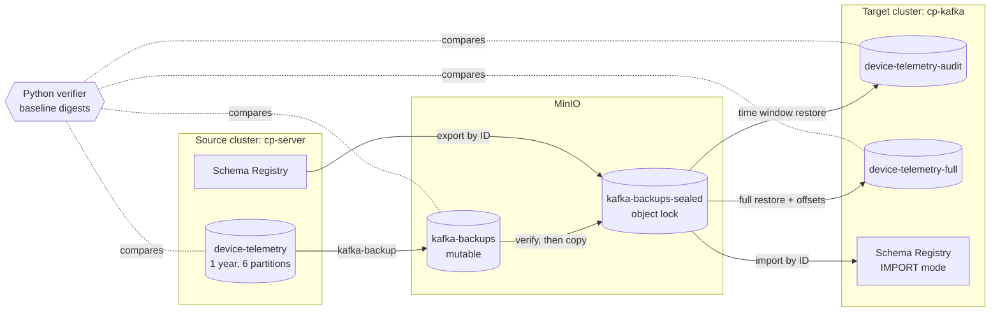

# Kafka Topic Offload: lower Kafka retention safely with verified backup and restore

[](https://github.com/osodevops/kafka-topic-offload-demo/actions/workflows/smoke.yml)
[](LICENSE)
[](https://docs.confluent.io/platform/current/)
[](https://github.com/osodevops/kafka-backup)

**Move years of Apache Kafka topic history into cheap object storage, cut `retention.ms` on the live topic, and restore any time window later, with checksum level evidence at every step.**

Large Kafka topics that hold compliance data, IoT telemetry or audit trails often dominate the storage bill on Confluent Cloud and self managed clusters. Nobody wants to lower retention on regulated data on trust alone. This repository runs the whole offload on a local Confluent stack, at 1 GB in minutes or 100 GB in under an hour on a large workstation. It proves each step with gates that fail loudly:

```
seed -> baseline -> export schemas -> back up -> verify -> seal -> gate -> lower retention -> restore -> verify
```

- **Backup and restore:** [kafka-backup](https://github.com/osodevops/kafka-backup), open source and MIT licensed.
- **Kafka:** Confluent Platform 8.3.1 (KRaft) with Schema Registry.
- **Object storage:** MinIO with S3 object lock (WORM).
- **Verifier:** an independent Python verifier that never trusts the backup tool's own output.

## Contents

- [Who this is for](#who-this-is-for)
- [What it proves](#what-it-proves)
- [Results from the 100 GB reference run](#results-from-the-100-gb-reference-run)
- [Quick start](#quick-start)
- [How it works](#how-it-works)
- [What you can choose to archive, and what to bring back](#what-you-can-choose-to-archive-and-what-to-bring-back)
- [How to restore offloaded Kafka data](#how-to-restore-offloaded-kafka-data)
- [Configuration](#configuration)
- [Cost](#cost)
- [FAQ](#faq)
- [Documentation](#documentation)
- [Repository layout](#repository-layout)

## Who this is for

- **Platform teams:** paying for terabytes of retained Kafka data they rarely read.
- **Data owners and compliance teams:** anyone who must keep records for years and prove they can be produced on request.
- **Confluent Cloud users:** looking for a cheaper home for cold topic history than cluster storage.
- **Kafka engineers:** anyone evaluating Kafka backup, archive to S3 or Azure Blob Storage, and point in time restore tools.

## What it proves

| Claim | How the demo proves it |
|---|---|
| The backup holds every record, byte for byte | `validate --deep` must print exactly `Result: VALID`. Then every stored object's SHA-256 is checked, and every record is decoded with an independent reader and compared per UTC day with a digest of the source taken before any change |
| Lowering `retention.ms` deletes exactly what was predicted, nothing newer | Kafka's segment deletion rule is applied to the real segment files first; the broker must then match the predicted log start offsets, surviving segments and reclaimed bytes exactly |
| No consumer is silently cut off | The prune gate blocks while any consumer group sits behind the new log start unless it is acknowledged; the affected group resumes with `auto.offset.reset=error` and gets `OffsetOutOfRange` |
| Deleted history can be restored on a different cluster, identical to the source | A month from nine months ago is restored from the sealed backup into a new topic and compared per day by digest; a full restore maps consumer group offsets |
| Schema IDs still mean the same schemas | Schemas are exported by ID, imported in IMPORT mode, and every ID found in the restored data is resolved on both registries |
| The archive is readable without the backup tool | A sealed segment is decoded with a 60 line Python reader of the documented binary format |
| The gates can fail | `make negative-tests` injects a data gap, a corrupted object, a schema ID mismatch, an unacknowledged consumer and an unpadded time window; each must fail its named gate |

## Results from the 100 GB reference run

Full report: [`evidence/reference-100g/report.md`](evidence/reference-100g/report.md). Every file is listed in `SHA256SUMS`, and [`NOTES.md`](evidence/reference-100g/NOTES.md) describes the run.

| Step | Result |
|---|---|
| Topic | 53,687,091 Avro records, 105 GB on the broker, one year of timestamps including 266,068 late arriving records |
| Backup | 834 objects, 43.3 GB stored (2.58x zstd), 72 seconds; every object checksum and every record verified against the baseline |
| Retention lowered to 30 days | 95.37 GB reclaimed, exactly as predicted to the byte; 48,687,479 records removed from the live topic, every one in the sealed backup |
| Audit restore | A month from nine months ago, 5,294,833 records in 33 seconds, identical to the source for every day; 182 of them recovered only because the window was padded |
| Full restore | 53,687,091 records in about 8 minutes, identical to the source, consumer group offsets mapped exactly |
| Archive options | A 90 day archive of 13,237,908 records verified against the source; a 30 day range restored as at an instant, 4,412,442 records identical on every interior day; the archive aged from 43.3 GB to 21.6 GB with 6 pruned ranges recorded and still valid |
| Negative tests | 5 of 5 failed their named gate as designed |

These are local, single node rates on a 32 core Mac. The [extrapolation](evidence/reference-100g/restore/extrapolation.json) caps them at Confluent Cloud's per CKU throughput guidance.

## Quick start

Requirements:

- **Tools:** Docker with Compose v2, `make`, `perl`, `python3` (standard library only), `git`, `shasum`.
- **Resources:** see the table below.

| Scale | Data | Docker memory | Free disk in the Docker VM | Wall clock (32 core Mac) |
|---|---|---|---|---|
| `smoke` | 1 GB | 12 GiB | 6 GiB | about 5 minutes |
| `10g` | 10 GB | 16 GiB | 35 GiB | not measured |
| `100g` | 100 GB | 24 GiB | 280 GiB | about 25 minutes, plus up to 30 if the prune gate has to wait |

```bash
git clone https://github.com/osodevops/kafka-topic-offload-demo.git
cd kafka-topic-offload-demo

make all SCALE=smoke        # every phase, each with its gates
make negative-tests         # five scenarios that must fail
cat "evidence/$(cat evidence/.current-run)/report.md"

make clean                  # stop the stack and delete its volumes (evidence is kept)
```

On arm64 hosts the first run builds kafka-backup 0.22.0 natively from its release tag (about 10 minutes), because the published image is amd64 only. On amd64, `KAFKA_BACKUP_IMAGE=osodevops/kafka-backup:v0.22.0` is used as is.

The [walkthrough](docs/walkthrough.md) runs every phase by hand and explains what to look at.

## How it works



| Phase | What happens | Key gates |
|---|---|---|
| `00-preflight` | Tools, Docker memory and disk, pinned images, native kafka-backup build, stack up, `environment.json` | `preflight.kafka_backup_native` |
| `10-seed` | One year of Avro device telemetry with 0.5% late records and midnight boundary records; a consumer group committed 60 days behind | `seed.watermarks` |
| `20-baseline` | One read of the source: digests per partition, per UTC day and per broker segment | `baseline.only_late_cohort_goes_backwards` |
| `25-schema-export` | Every schema ID the data uses, exported with subjects and versions | `schemas.exported` |
| `30-backup` | Snapshot backup to MinIO, timed, with S3 request counts, plus a comparison run at 4x larger segments | `backup.completed` |
| `35-verify-backup` | Strict `validate --deep`, then independent manifest, SHA-256 and record level verification | `backup.content_matches_source_baseline` |
| `38-seal` | Copy to an object lock bucket, apply retention, prove a sealed version cannot be deleted | `seal.worm_blocks_version_delete` |
| `45-archive-options` | Archive from a chosen instant, restore a time range as at that instant, and age the archive with its own retention | `archive.since.starts_at_the_instant`, `restore.asat.no_records_outside_window`, `archive.retention.size_cap_applied` |
| `40-prune-gate` | Backup and seal intact, topic unchanged, exact deletion prediction, consumer impact acknowledged | `prune_gate.*` |
| `50-retention-prune` | `retention.ms` lowered to 30 days; the broker compared with the prediction | `prune.bytes_reclaimed_match_prediction` |
| `60-audit-restore` | Schemas imported by ID; a padded month restored from the sealed copy to a new topic on another cluster | `restore.audit.batch_fits_message_max_bytes` |
| `65-verify-restore` | Restored records keyed by `x-original-offset` and compared with the baseline per day | `restore.audit.buckets_match_baseline` |
| `70-full-restore` | Everything restored with consumer group offsets; extrapolation to larger topics | `restore.full.consumer_group_offset_mapped` |
| `75-readable-archive` | A sealed segment decoded without kafka-backup | `archive.segment_readable_without_kafka_backup` |
| `80-report` | `report.md` and `SHA256SUMS` | |
| `95-negative-tests` | Five failure scenarios | `negative.*` |
| `90-azurite` | Azure Blob client path against Azurite, outside the verdict until kafka-backup supports the emulator | `azurite.backup` |

[How it works](docs/how-it-works.md) explains the Kafka mechanics behind the gates:
- exactly how `retention.ms` deletes segments;
- why one late or future timestamp pins a whole segment;
- how restored records are matched to their source offsets;
- the kafka-backup segment format.

## What you can choose to archive, and what to bring back

You are not limited to "archive everything, restore everything". Phase `45-archive-options` runs all three choices below and gates each one.

### Archive from a point in time

Kafka turns an instant into the first offset at or after it on each partition, and kafka-backup takes those offsets as its start. So an archive can hold "the last 90 days" rather than all history, which is what you want when you start archiving an existing topic, or when older data is already elsewhere.

```
GATE archive.since.offsets_for_time_resolved: PASS - 6 of 6 partitions have an offset at or after the instant
GATE backup.content_matches_source_baseline.since: PASS - 540 fully covered partition-day buckets: count, min/max ts and SHA-256 identical
device-telemetry-since: 13,237,908 records in 210 objects, 10.69 GB, covering 2026-06-18 04:00 to 2026-09-16 03:59 UTC
```

There is no matching end bound in kafka-backup 0.22.0: a backup runs from its start offsets to the high watermark taken at start-up, which is what makes it a point-in-time snapshot.

### Restore a time range, as at an instant

`time_window_start` and `time_window_end` bring back any range, and nothing newer than the end. That covers an audit request, a replay of one bad day, or the topic as it stood before an incident.

```
GATE restore.asat.no_records_outside_window: PASS - window 1779163200000..1781755199999
GATE restore.asat.buckets_match_baseline: PASS - 4,412,442 records; 25 days x 6 partitions compared exactly
```

Restores always go into a new topic, with `retention.ms=-1`, and fail rather than touch an existing one.

### Keep a rolling range in object storage

The archive has its own retention, separate from the topic's. `backup.retention` (`max_age`, `max_total_bytes`, `keep_segments`) applies it during a run, and `kafka-backup prune` applies it on demand, plan first and `--execute` to act. Pruned ranges are recorded in the manifest, so the archive stays valid and says what it no longer holds.

```
GATE archive.retention.size_cap_applied: PASS - archive went from 43265098531 to 21611435614 bytes, cap 21632549265, 6 pruned range(s) recorded in the manifest
GATE archive.retention.pruned_archive_still_valid: PASS - deliberate retention is not corruption
```

**Age is measured from upload time**, not record time, wherever an object records one. A bulk import of ten years of history ages as a single cohort, so `--older-than 30d` removes nothing from an archive written today. Size caps behave as expected; for age based policies on imported history, prune by explicit cutoff (`--before`) instead.

## How to restore offloaded Kafka data

1. **Pick the time window** and pad it on both sides by the maximum lateness of your data (kafka-backup 0.22.0 selects segments by first and last record timestamp, so late records near the edges are otherwise skipped).
2. **Rehydrate first** if the objects are in an archive tier.
3. **Import schemas:** load the exported schemas into the restore registry in IMPORT mode so every schema ID is preserved.
4. **Restore into a new topic** with [`config/kafka-backup/audit-restore.yaml.tmpl`](config/kafka-backup/audit-restore.yaml.tmpl), which sets `retention.ms=-1` and fails if the topic already exists. For a full rollback with consumer group offsets, use [`full-restore.yaml.tmpl`](config/kafka-backup/full-restore.yaml.tmpl). Never restore into the live topic.
5. **Verify** with `verify-restore` and `schema-check` before anyone relies on the data.

The [Confluent Cloud runbook](docs/runbook-confluent-cloud.md) turns this into a production procedure, covering access, quotas, staged retention changes, immutable storage and drills.

## Configuration

`.env` is created from `.env.example` the first time a phase runs. Anything set on the command line wins, for example `make all SCALE=100g SEED=42`.

| Variable | Default | Meaning |
|---|---|---|
| `SCALE` | `smoke` | `smoke` (1 GB), `10g` or `100g` |
| `SEED` | `20260915` | Makes the generated dataset reproducible |
| `TOPIC`, `PARTITIONS` | `device-telemetry`, 6 | The topic that is seeded and offloaded |
| `RETENTION_AFTER_PRUNE_MS` | 30 days | Retention applied to the live topic in phase 50 |
| `AUDIT_MONTHS_AGO`, `AUDIT_DAYS` | 9, 30 | The audit window restored in phase 60 |
| `LATE_MAX_HOURS` | 72 | Maximum lateness in the data, and the pad used on restore windows |
| `ACK_CONSUMER_IMPACT` | `telemetry-analytics` | Consumer groups allowed to fall below the new log start |
| `ARCHIVE_SINCE_DAYS` | 90 | How far back the partial archive starts in phase 45 |
| `ASAT_RANGE_DAYS` | 30 | Length of the time range restored as at that instant |
| `EXTRAPOLATE_SIZES_TB` | `1,10,50` | Topic sizes the measured rates are projected onto |
| `CONFLUENT_CKU` | 2 | Cluster size behind the throughput caps in the extrapolation |
| `SKIP_SEGMENT_COMPARISON` | `0` | Skip the second backup at 4x larger segments |
| `SEAL_MODE`, `SEAL_RETENTION` | `GOVERNANCE`, `30d` | Object lock mode and retention applied when sealing |
| `KAFKA_BACKUP_IMAGE` | native build | Image used for kafka-backup; set it to `osodevops/kafka-backup:v0.22.0` on amd64 |

Every image is pinned in `.env.example`, and each run records the digests it used in `evidence/<run>/environment.json`.

## Cost

Measured at 100 GB: kafka-backup made **1.02 PUT requests per 128 MiB object**, so backing up 10 TB into Azure Blob Storage Hot costs about $0.38 in request charges in eastus. Storage then dominates:

| 10 TB logical, 2.58x compression | Hot | Cool | Cold | Archive |
|---|---|---|---|---|
| Storage per month (eastus, LRS) | $75 | $55 | $13 | $4 |

Small objects are what make archives expensive: 10 TB written as one object per 2 KB record would cost about $25,000 in write operations. See the [cost model](docs/cost-model.md). `tools/cost_model.py` pulls live prices for any Azure region.

## FAQ

**How do I reduce Kafka storage costs without losing data?**
Back up the topic to object storage, verify the backup independently, seal it, and only then lower `retention.ms`. This repository automates and gates each of those steps.

**Can I delete old data from a Kafka topic and restore it later?**
Yes. Kafka deletes whole segments once their newest record is older than `retention.ms`. The deleted range can be restored from the backup into a new topic, with original offsets and timestamps carried in record headers.

**How does Kafka `retention.ms` decide what to delete?**
A segment is deleted when `now - largestTimestamp > retention.ms`. Segments are checked oldest first, deletion stops at the first segment that must be kept, and never passes the high watermark. See [how it works](docs/how-it-works.md#1-what-kafka-deletes-when-retention-is-lowered).

**Do consumer group offsets survive a restore?**
Restored records get new offsets. kafka-backup stores each record's original offset in an `x-original-offset` header and resets consumer groups on the target through it. The demo proves the mapping record by record.

**What happens to Schema Registry schema IDs?**
Confluent wire format values embed a schema ID. The demo exports every ID the data uses and imports them in IMPORT mode, so the same ID resolves to the same schema after restore. A negative test shows silent mis-decoding when this is skipped.

**Can I archive only part of a topic, for example the last 90 days?**
Yes. Kafka resolves an instant to per partition offsets, and those become the backup's start. The demo archives 90 days of a one year topic and checks the result against a digest of the source. There is no end bound, so an archive always runs to the high watermark at start-up.

**Can I restore a Kafka topic as it was at a point in time?**
Yes. Set `time_window_end` to that instant, with `time_window_start` bounding how far back you want. Nothing newer comes back, and the demo verifies the restored range against the source day by day.

**Can I keep only the last N years in object storage?**
Yes. The archive has its own retention, by age, by total size, or with a minimum number of segments kept per partition, applied by `kafka-backup prune` or during a backup run. Pruned ranges stay recorded in the manifest, so the archive remains valid and self describing. Note that age is measured from upload time where recorded, which matters for bulk imports of old data.

**Does this work with Confluent Cloud?**
The mechanics are the same, but segment files are not visible on Confluent Cloud. Read the [runbook](docs/runbook-confluent-cloud.md) and [limitations](docs/limitations.md), and run a nonprod pilot first.

**Does it support Amazon S3 and Azure Blob Storage?**
kafka-backup supports S3, S3 compatible stores, Azure Blob Storage and Google Cloud Storage. The demo runs on MinIO (S3 API). The Azure path is scaffolded against Azurite, but the emulator is blocked in kafka-backup 0.22.0.

**Is kafka-backup free?**
Yes. [kafka-backup](https://github.com/osodevops/kafka-backup) is open source under the MIT licence.

## Documentation

- [Walkthrough](docs/walkthrough.md): run every phase step by step, with example output and how to inspect each result.
- [How it works](docs/how-it-works.md): retention mechanics, the digest, the backup segment format, the time window behaviour, schema IDs, evidence layout.
- [Runbook for Confluent Cloud](docs/runbook-confluent-cloud.md): the production procedure.
- [Cost model](docs/cost-model.md): storage, transactions and Data Out.
- [Limitations](docs/limitations.md): what a local run cannot prove, and kafka-backup 0.22.0 behaviour worked around here.

## Repository layout

```
compose/docker-compose.yml   source cp-server, target cp-kafka, two registries, MinIO, Azurite, tools
config/schemas/              Avro schemas for the generated telemetry
config/kafka-backup/         kafka-backup backup and restore config templates
scripts/                     lib.sh and one gated script per phase
tools/verifier/              Python evidence tooling: seed, baseline, verify, prune prediction, segment reader, report
tools/cost_model.py          cost tables from measured request counts and Azure retail prices
evidence/reference-100g/     committed evidence from the 100 GB run
docs/                        walkthrough, how it works, runbook, cost model, limitations
```

## Related projects

- [osodevops/kafka-backup](https://github.com/osodevops/kafka-backup): high performance Kafka backup and point in time restore.
- [osodevops/kafka-backup-demos](https://github.com/osodevops/kafka-backup-demos): shorter demos of individual kafka-backup features.
- [osodevops/kafka-backup-operator](https://github.com/osodevops/kafka-backup-operator): run kafka-backup on Kubernetes.

## License

MIT. Built by [OSO](https://oso.sh), specialists in Apache Kafka and event streaming.
